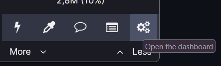

# neku's discord css tweaks
i didn't like how they scaled the buttons last update

## what they do
1. server icons are larger (can be adjusted in settings section)
2. the buttons for emojis, stickers, gifs, etc. are larger (can be adjusted in settings section)
3. dm buttons are centered
4. server icons are circular when you don't hover over them
5. the bar at the top is removed and the inbox button moved down

## how to apply them
### ublock origin browser plugin
if you have ublock installed, go to settings by clicking on the extension's icon and then opening the dashboard (the gears icon in the bottom right of the menu).

in the settings, click on "my filters" at the top. copy the filters from [ublock-filters.txt](ublock-filters.txt) into the text box and then click on "apply changes". once you refresh or open a new tab with discord running, the changes should be visible.

### pure custom css
ublock filters are not written in css. they have a slightly different syntax. you can find a version in pure css in [stylesheet.css](stylesheet.css).
if you apply these in the client, make sure to remove the last section (starting with `--TOP BAR--`) to preserve the window's navigation buttons (_ [] X).

### remove individual filters
apart from the settings, any of the other sections that start with `--SECTION NAME--` can be removed without side effects if there are tweaks you don't want to use.
